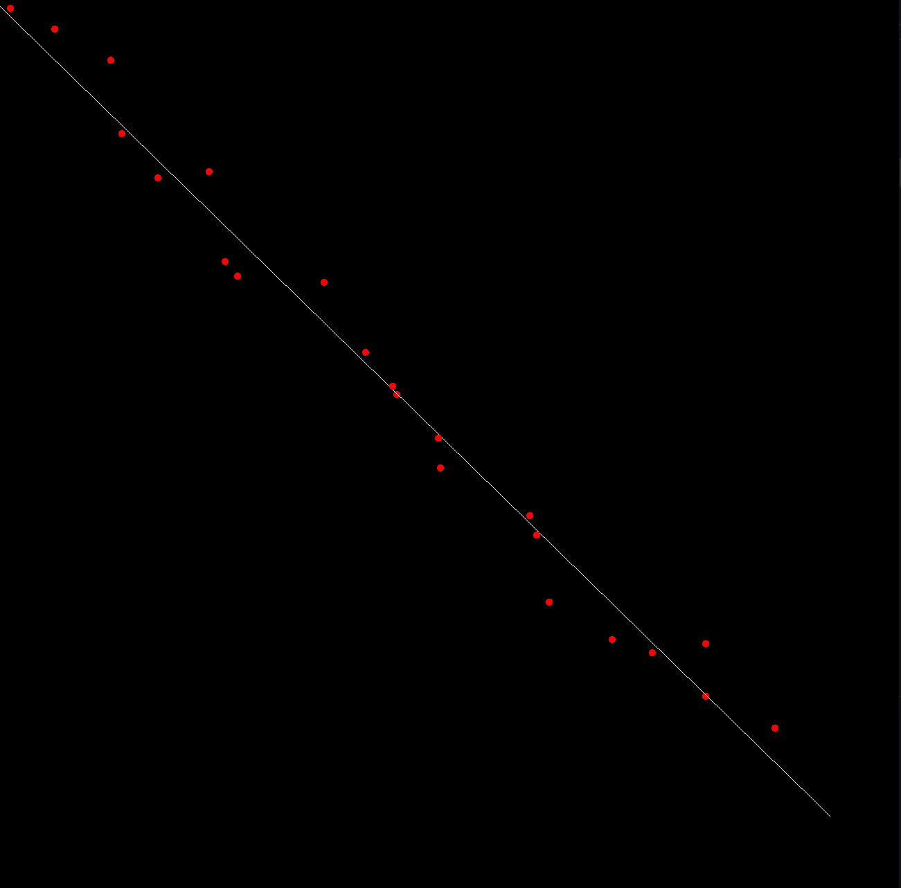
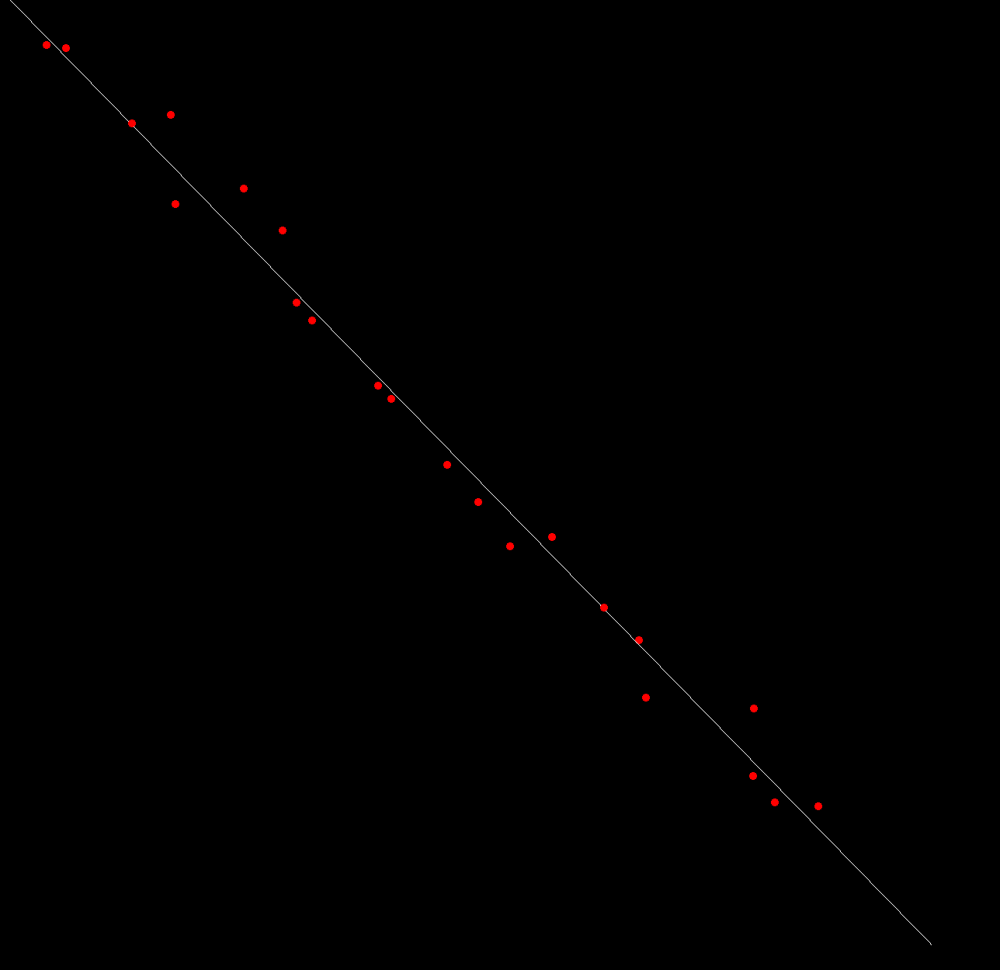

# Lienear regression in X87 Assembly

## Structure

### 1. X87 Asseembly file to calculate the slope "m" and the intercept "b"

### 2. C++ SFML Visualizer of the Linear Regression Line

## Example:

